# Phase 1.2 — Sitemap

> **Statut** : 🟡 En attente de validation HITL
> **Équipe** : Product Owner, UX/UI Designer, Expert SEO, Architecte Front-end
> **S'appuie sur** : Best Practices 1.0 (D-001 à D-004), Vision Produit 1.1 (D-008 à D-011).

---

## 1. Vue d'ensemble

```mermaid
graph TD
    HOME["Accueil /"]

    HOME --> CHIEN["Chien /chien"]
    HOME --> CHAT["Chat /chat"]
    HOME --> NAC["NAC /nac"]
    HOME --> NOUV["Nouveautés /nouveautes"]
    HOME --> GUIDES["Guides & Conseils /guides"]
    HOME --> MARQUE["Notre histoire /notre-histoire"]

    CHIEN --> C1["Colliers & Harnais"]
    CHIEN --> C2["Laisses"]
    CHIEN --> C3["Couchages & Paniers"]
    CHIEN --> C4["Jouets"]
    CHIEN --> C5["Gamelles & Repas"]
    CHIEN --> C6["Transport & Voyage"]
    CHIEN --> C7["Toilettage & Soin"]
    CHIEN --> C8["Manteaux & Textile"]

    CHAT --> K1["Colliers"]
    CHAT --> K2["Couchages & Cocons"]
    CHAT --> K3["Arbres à chat & Griffoirs"]
    CHAT --> K4["Jouets"]
    CHAT --> K5["Gamelles & Fontaines"]
    CHAT --> K6["Litière & Maison"]
    CHAT --> K7["Transport & Voyage"]

    NAC --> N1["Habitat & Couchage"]
    NAC --> N2["Jeux & Activité"]
    NAC --> N3["Repas & Accessoires"]

    C1 --> PDP["Fiche produit /chien/colliers-harnais/{slug}"]
    GUIDES --> ART["Article /guides/{slug}"]
```



## 2. Inventaire complet des pages

### 2.1 Catalogue (indexable SEO)

| Page | URL | Rôle |
|---|---|---|
| Accueil | `/` | Vitrine du positionnement, entrées par animal, mise en avant éditoriale |
| Catégorie animal (×3) | `/chien`, `/chat`, `/nac` | Page d'aperçu cliquable (D-002) : sous-catégories, best-sellers, guides liés |
| Sous-catégorie | `/chien/colliers-harnais`, `/chat/arbres-a-chat-griffoirs`, … | Listing produits avec facettes (taille, matière, couleur, prix, marque) |
| Fiche produit | `/{animal}/{sous-categorie}/{slug-produit}` | Conversion : variantes, guide des tailles, photos, avis, cross-sell |
| Nouveautés | `/nouveautes` | Listing transverse (produits récents, toutes espèces) |
| Recherche | `/recherche?q=` | Résultats produits + contenus (non indexée) |

Sous-catégories au lancement : **8 chien, 7 chat, 3 NAC** (D-005 : NAC volontairement restreint) — chacune devra compter ≥ 10 produits (D-002), sinon fusion à prévoir.

### 2.2 Contenu éditorial (indexable SEO)

| Page | URL | Rôle |
|---|---|---|
| Hub Guides & Conseils | `/guides` | Accueil éditorial, filtrable par espèce et thème |
| Article / guide d'achat | `/guides/{slug}` | Conseil expert, maillé vers les catégories/produits concernés |
| Notre histoire | `/notre-histoire` | Storytelling de marque : curation, valeurs, engagements |

### 2.3 Tunnel d'achat (non indexé)

| Page | URL | Rôle |
|---|---|---|
| Panier | `/panier` | Récap, coûts transparents dès cette étape (D-004) |
| Checkout | `/checkout` | Invité par défaut ; étapes : coordonnées → livraison → paiement |
| Confirmation | `/checkout/confirmation` | Récap commande + proposition de création de compte *post-achat* |

### 2.4 Compte client (non indexé)

| Page | URL | Rôle |
|---|---|---|
| Connexion / inscription | `/compte/connexion` | Auth (+ récupération mot de passe `/compte/mot-de-passe`) |
| Tableau de bord | `/compte` | Vue d'ensemble, accès rapide « racheter » |
| Commandes | `/compte/commandes`, `/compte/commandes/{id}` | Historique, suivi, retour |
| Profil animal | `/compte/animaux` | CRUD animaux (espèce, race, taille, âge) → personnalisation |
| Adresses | `/compte/adresses` | Gestion adresses |
| Informations | `/compte/informations` | E-mail, mot de passe, préférences de communication |

### 2.5 Confiance & support (indexable)

| Page | URL |
|---|---|
| Livraison & retours | `/livraison-retours` |
| FAQ | `/faq` |
| Contact | `/contact` |
| Suivi de commande (invité) | `/suivi-commande` |

### 2.6 Légal (indexable, noindex facultatif)

`/cgv`, `/confidentialite`, `/mentions-legales`, `/cookies`

### 2.7 Système

Page 404 enrichie (recherche + catégories populaires), page 500, page maintenance.

### 2.8 Administration (Phase 7 — hors sitemap public)

`/admin` et ses sous-sections (dashboard, produits, commandes, clients, contenus) — détaillées en Phase 7, non indexées, accès authentifié par rôle.

## 3. Navigation principale

### Desktop — header

```
[Logo]   Chien ▾   Chat ▾   NAC ▾   Nouveautés   Guides & Conseils        [Recherche] [Compte] [Panier]
```

- **Méga-menu** au survol de Chien/Chat/NAC : sous-catégories en colonnes + 1 visuel de mise en avant + lien « Tout voir » (catégorie parente cliquable, D-002).
- Bandeau fin au-dessus du header : réassurance rotative (livraison offerte dès X €, retours 30 jours).

### Mobile — menu hamburger + barre fixe

- Premier niveau du menu = **Chien / Chat / NAC / Nouveautés / Guides** (catégories d'abord, D-003) ; liens secondaires (compte, aide, contact) en bas de menu.
- Barre inférieure fixe : Accueil · Recherche · Compte · Panier.

### Fil d'Ariane

Sur toutes les pages catalogue et éditoriales : `Accueil > Chien > Colliers & Harnais > {Produit}`.

### Footer (4 colonnes)

1. **Boutique** : Chien, Chat, NAC, Nouveautés
2. **Aide** : Livraison & retours, FAQ, Suivi de commande, Contact
3. **La marque** : Notre histoire, Guides & Conseils, CGV, Confidentialité
4. **Newsletter** + réseaux sociaux + moyens de paiement

## 4. Justification des choix

- **Entrée primaire par animal** (D-001) : le méga-menu et les URLs reflètent le modèle mental client ; l'entrée « par usage » est servie par les sous-catégories et les facettes, sans dupliquer l'arborescence (pas d'URL `/colliers` transverse au lancement → évite le contenu dupliqué).
- **Profondeur ≤ 3 niveaux** (D-002) : `animal → sous-catégorie → produit`. Pas de sous-sous-catégories au lancement ; si une sous-catégorie dépasse ~10 segments logiques, on la scindera (décision à consigner).
- **Nouveautés en premier niveau** : soutient le réachat et les visites récurrentes (persona « pet parent » revient régulièrement) à moindre coût.
- **Pas de page « Promotions » au lancement** : cohérence avec le positionnement premium (D-008) — les remises permanentes dévalorisent la marque. Les opérations ponctuelles (soldes) seront gérées par bannières et collections temporaires.
- **Recherche et tunnel non indexés** : hygiène SEO standard ; les facettes génèrent des URLs canoniques maîtrisées (détail technique en Phase 5).

## 5. Hypothèses de cette étape

- **H7** : les noms de sous-catégories sont des propositions à affiner avec le catalogue réel fournisseurs.
- **H8** : une page « Collections » (ex. sélections saisonnières, guide cadeaux) est prévue en évolution, pas au lancement.
