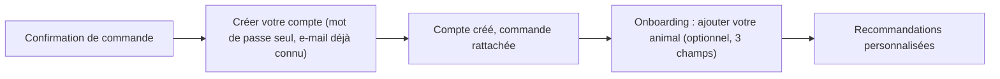
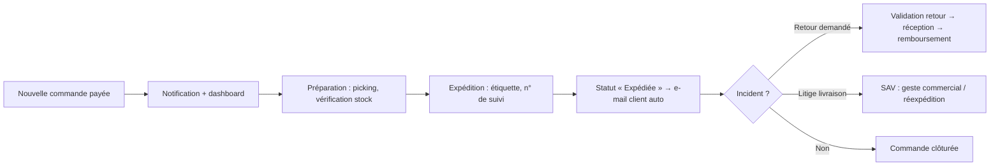

# Phase 1.3 — User Flows

> **Statut** : 🟡 En attente de validation HITL
> **Équipe** : UX Researcher, UX/UI Designer, Product Owner
> **S'appuie sur** : Vision Produit 1.1, Sitemap 1.2 (D-001 à D-014).

Trois familles de parcours : **visiteur** (découverte → achat), **client** (compte, réachat, SAV), **administrateur** (exploitation). Chaque parcours identifie les points de friction connus et la réponse produit.

---

## 1. Parcours visiteur

### 1.1 Découverte → Achat (parcours principal)

```mermaid
flowchart LR
    A[Entrée : SEO / Ads / Social / Direct] --> B{Page d'entrée}
    B -->|Home| C[Choix animal]
    B -->|Catégorie SEO| D[Listing sous-catégorie]
    B -->|Fiche produit SEO/Ads| E[Fiche produit]
    C --> D
    D -->|Facettes : taille, matière, prix| E
    E -->|Choix variante + taille| F[Ajout panier]
    F -->|Mini-panier confirmé| G{Continuer ?}
    G -->|Continuer achats| D
    G -->|Commander| H[Panier]
    H --> I[Checkout invité]
    I --> J[Coordonnées] --> K[Livraison] --> L[Paiement]
    L --> M[Confirmation]
    M -.->|Proposition post-achat| N[Création de compte 1-clic]
```

**Points d'attention intégrés :**

| Étape | Friction connue | Réponse produit |
|---|---|---|
| Entrée hors home | Le visiteur n'a pas le contexte de marque | Header/réassurance identiques partout ; fil d'Ariane ; blocs « pourquoi nous » sur listing et fiche |
| Fiche produit | Doute sur la taille (cause n°1 de retour dans le pet) | Guide des tailles par espèce/race, photos à l'échelle, rappel « retours 30 jours » |
| Ajout panier | Rupture de contexte si redirection | Mini-panier (drawer) avec cross-sell léger, sans quitter la page |
| Panier | Frais découverts tardivement (~40 % d'abandon) | Frais de port et délais estimés affichés dès le panier (D-004) |
| Checkout | Compte forcé (24 % d'abandon) | Invité par défaut (D-014) ; e-mail demandé en premier (permet la relance panier) |
| Paiement | Pic d'anxiété | Badges sécurité et rappel retours adjacents au bouton payer ; Apple Pay/Google Pay/PayPal en express |

### 1.2 Recherche directe

`Barre de recherche → autocomplétion (produits, catégories, guides) → résultats → fiche produit`. Recherche vide ou sans résultat → suggestions de catégories populaires + guides. Les utilisateurs de la recherche convertissent 2–3× plus : la barre est toujours visible (desktop) / accessible en 1 tap (barre fixe mobile).

### 1.3 Visiteur « offreur » (persona secondaire)

`Home ou Guides → guide cadeau par espèce → sélection → fiche produit → achat invité`. Ne connaît pas la taille de l'animal → mise en avant des produits « taille unique » et du rappel retours 30 jours. (Carte cadeau : évolution post-lancement, D-011/H8.)

### 1.4 Consultation éditoriale → catalogue

`Entrée SEO sur un guide → contenu conseil → liens produits/catégories contextuels → listing ou fiche`. Chaque guide se termine par une sélection de produits liés (maillage systématique, D-001).

---

## 2. Parcours client

### 2.1 Création de compte (post-achat)

L'onboarding « profil animal » est **optionnel et différé** : jamais bloquant, relançable depuis le tableau de bord et par e-mail. C'est le levier de personnalisation clé du secteur (Best Practices 1.0).

### 2.2 Réachat (parcours stratégique — objectif ≥ 25 % à 6 mois)

`Connexion → tableau de bord → « Racheter » depuis l'historique → panier pré-rempli → checkout accéléré (adresses et préférences pré-remplies)`. Complété par les e-mails de cycle de vie (recommandations selon le profil animal). Socle conçu pour accueillir l'abonnement plus tard (D-006).

### 2.3 Suivi et après-vente

- **Suivi** : e-mail expédition → page suivi (compte ou `/suivi-commande` invité avec n° + e-mail).
- **Retour** : `Compte → commande → déclarer un retour → motif → étiquette → remboursement notifié`. Parcours invité équivalent via `/suivi-commande`.
- **Contact** : formulaire + e-mail, promesse de réponse < 24 h ouvrées (D-008). Le service client premium est un levier d'acquisition (modèle Chewy).

### 2.4 Gestion du profil animal

`Compte → Mes animaux → ajouter/modifier (espèce, race, taille, âge)`. Effets : recommandations home/fiche produit personnalisées, pré-filtrage des tailles sur les listings, e-mails ciblés.

---

## 3. Parcours administrateur

Conçus **en miroir des parcours client** (Best Practices 1.0) ; l'interface détaillée sera traitée en Phase 7.

### 3.1 Traitement d'une commande (cœur d'exploitation)

Statuts de commande : `Payée → En préparation → Expédiée → Livrée → Clôturée`, avec branches `Retour en cours`, `Remboursée`, `Annulée`. Chaque transition déclenche la notification client correspondante.

### 3.2 Gestion du catalogue

`Créer/modifier produit (infos, variantes taille-couleur, prix, photos, catégorie, SEO) → brouillon → prévisualisation → publication`. Alerte stock bas ; une sous-catégorie qui passe sous 10 produits actifs remonte une alerte (D-002).

### 3.3 Gestion des clients et contenus

- **Clients** : recherche, historique, commandes, remboursements, anonymisation RGPD sur demande.
- **Contenus** : création/édition des guides (brouillon → publication), gestion des bannières home et des blocs de réassurance.

### 3.4 Rôles

| Rôle | Portée |
|---|---|
| **Admin** | Tout, y compris config et utilisateurs back-office |
| **Ops** | Commandes, retours, clients |
| **Catalogue** | Produits, stocks, catégories |
| **Éditorial** | Guides, bannières, pages de contenu |

(Granularité fine des permissions : Phase 7.)

---

## 4. Hypothèses de cette étape

- **H9** : la relance de panier abandonné par e-mail (permise par la saisie e-mail en début de checkout) est prévue au lancement — simple, fort ROI.
- **H10** : la logistique est internalisée ou confiée à un 3PL unique ; le flux admin d'expédition suppose une génération d'étiquette intégrée (à confirmer en Phase 6).
- **H11** : un seul entrepôt/stock au lancement (pas de multi-stock).
